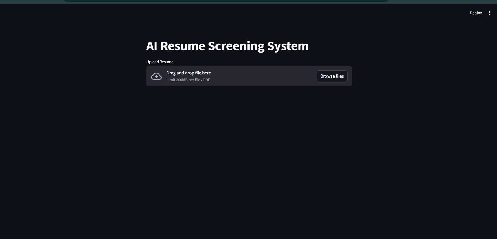
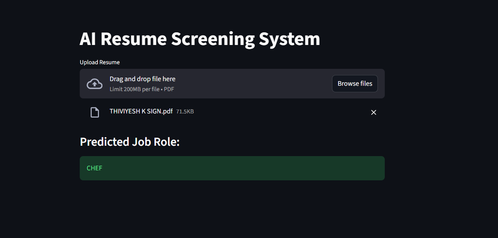

###### **AI Resume Screening System**

An intelligent AI-powered application that automates resume screening and predicts the most suitable job role based on candidate profiles. This project combines Natural Language Processing (NLP) and Machine Learning to streamline the recruitment process and assist hiring teams in faster decision-making.

###### 

###### **Project Overview**

Recruiters often spend hours manually reviewing resumes. This system solves that problem by:

\* Automatically analyzing uploaded resumes (PDF)

\* Extracting key information and skills

\* Predicting the most relevant job role

\* Providing data-driven insights through a dashboard

###### 

###### **Key Features**

* Upload resumes in PDF format
* AI-based job role prediction
* Skill extraction from resumes
* Fast and automated screening process
* Interactive analytics dashboard
* Handles multiple job categories

###### **AI \& ML Approach**

\* Text Extraction from PDF resumes

\* Text Preprocessing

\* Tokenization

\* Stopword removal

\* Cleaning

\* Feature Engineering

\* TF-IDF Vectorization

\* Model Used

###### **Dashboard Insights**

The analytics dashboard provides valuable hiring insights:

Resume Distribution

\* Engineering roles dominate the dataset

\* Indicates high demand and supply in technical fields

###### **Skills Analysis**

**Most common skills:**

&#x20; \* Python

&#x20; \* SQL

&#x20; \* Excel

&#x20; \* Machine Learning

Shows strong demand for data-related roles

**Resume Length Insights**

\* Technical resumes are longer

\* Include projects, certifications, and tools

**Candidate Insights**

Helps recruiters identify:

&#x20; \* Skill gaps

&#x20; \* Role distribution

&#x20; \* Candidate trends

**Application Preview**

Resume Upload \& Prediction

\* Upload resume (PDF)

\* System predicts job role instantly

**Example Output**

Predicted Job Role: CHEF

**Live Demo**

 https://resumeproject-p6a3x7bp7d87fsfkhqrs4f.streamlit.app/

## 📸 Screenshots

### Resume Output 1

### Resume Output 2

---

## 🎥 Demo Video

[Click to watch demo](resume_analyzer.mp4)

**Tech Stack**

\* Python

\* Streamlit (for web app)

\* Scikit-learn

\* Pandas \& NumPy

\* NLP Techniques (TF-IDF)

\* Power BI / Visualization Tools

###### Project Structure

project-name/

│

├── data/

│   └── resumes.csv

│

├── src/

│   ├── preprocessing.py

│   ├── model.py

│   ├── prediction.py

│   └── utils.py

│

├── app.py

├── requirements.txt

└── README.md

###### **How to Run**

1. Install dependencies
2. pip install -r requirements.txt
3. Run the application
4. streamlit run app.py

###### 

###### **Business Impact**

\* Reduces manual screening effort by 80%

\* Speeds up hiring process

\* Improves candidate-job matching accuracy

\* Helps recruiters focus on high-quality candidates

###### 

###### **Future Improvements**

\* Add deep learning models (BERT / NLP transformers)

\* Improve prediction accuracy

\* Multi-language resume support

\* Resume ranking system

\* Integration with job portals

###### **Author**

Thiviyesh K

Aspiring Data Analyst

